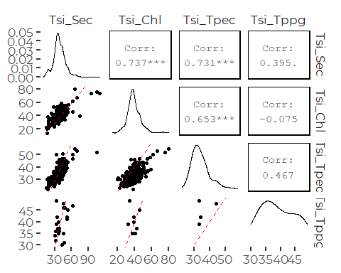
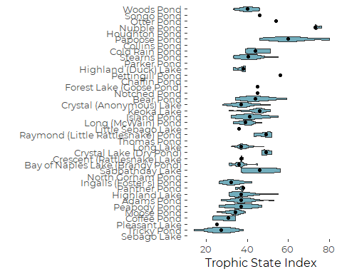
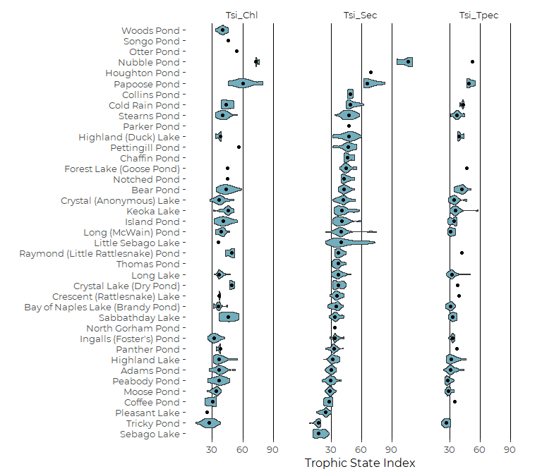
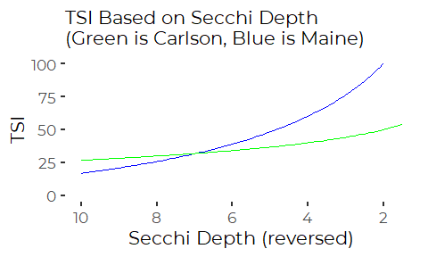
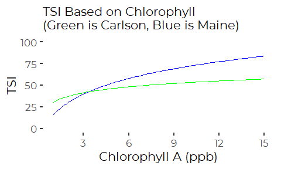
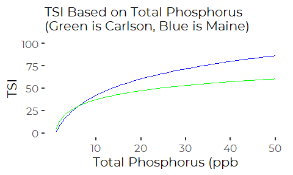

Assess Trophic State Index for Use in SoCB 2020
================
Curtis C. Bohlen, Casco Bay Estuary Partnership
12/18/2020

  - [Introduction](#introduction)
  - [Load Libraries](#load-libraries)
  - [Folder References](#folder-references)
  - [What is the Trophic State Index?](#what-is-the-trophic-state-index)
  - [Maine TSI Definitions](#maine-tsi-definitions)
  - [Other Versions of TSI](#other-versions-of-tsi)
      - [NALMS document](#nalms-document)
      - [Reviewing the Source](#reviewing-the-source)
      - [Carlson TSI Functions](#carlson-tsi-functions)
  - [Taylor Pond Example](#taylor-pond-example)
  - [Load Maine Lakes Annual TSI
    Data](#load-maine-lakes-annual-tsi-data)
  - [TSI Data Availability](#tsi-data-availability)
  - [Correlations Among TSI Scores](#correlations-among-tsi-scores)
  - [Preliminary Graphics](#preliminary-graphics)
      - [TSI<sub>Secchi</sub> Graphic](#tsisecchi-graphic)
      - [Grouped Graphic](#grouped-graphic)
      - [Comparison of Maine and Carson TSI
        Formulae](#comparison-of-maine-and-carson-tsi-formulae)
          - [Secchi Depth TSI](#secchi-depth-tsi)
          - [CHl TSI](#chl-tsi)
          - [TP TSI](#tp-tsi)


# Introduction

Maine often uses a “Trophic State Index” (TSI) to assess water quality
in Maine lakes. The index can be calculated multiple different ways,
based on measurement of Secchi depth, chlorophyll a, or total
phosphorus. Here, we explore the indexes Maine uses, and examine recent
TSI data to consider whether to include data or graphics on TSI in State
of the Bay.

Ultimately, we decide there is little value to adding a TSI metric to
SoCB, as the the most abundant TSI value is based on Secchi Depth, and
is a relatively simple transform of the Secchi depth data we have
already considered.

# Load Libraries

``` r
library(tidyverse)
#> -- Attaching packages --------------------------------------- tidyverse 1.3.0 --
#> v ggplot2 3.3.2     v purrr   0.3.4
#> v tibble  3.0.4     v dplyr   1.0.2
#> v tidyr   1.1.2     v stringr 1.4.0
#> v readr   1.4.0     v forcats 0.5.0
#> -- Conflicts ------------------------------------------ tidyverse_conflicts() --
#> x dplyr::filter() masks stats::filter()
#> x dplyr::lag()    masks stats::lag()
#library(readxl)
#library(readr)

library(GGally)
#> Registered S3 method overwritten by 'GGally':
#>   method from   
#>   +.gg   ggplot2

library(CBEPgraphics)
load_cbep_fonts()
theme_set(theme_cbep())
```

# Folder References

``` r
sibfldnm <- 'Derived_Data'
parent <- dirname(getwd())
sibling <- file.path(parent,sibfldnm)

dir.create(file.path(getwd(), 'figures'), showWarnings = FALSE)
```

# What is the Trophic State Index?

The Lakes of Maine web Site provides a document that explains the
Trophic State Index as follows:

[Explanation of Individual Lake Water Quality
Reports.pdf](https://www.lakesofmaine.org/data/Explanation%20of%20Individual%20Lake%20Water%20Quality%20Report.pdf)

> TROPHIC STATE INDICES: The Trophic State Index (TSI) is a scale which
> ranks lakes from 0 to 100+ with 0 supporting very little algae and
> 100+ being very productive. TSI can be calculated from the Secchi
> disk, Chlaor total phosphorus results. TSI for a year is only
> calculated when there are at least five months of data. Lakes with TSI
> values greater than 60 may support blooms (less than 2m SDT). Lakes
> with TSI values over 100 indicate extreme productivity and annual
> algal blooms. TSI values can be used to compare lakes and track water
> quality trends within a lake. Lakes with color over 30 SPU will only
> have a valid TSI if the value is calculated from Chla. The range of
> TSI is from 5-136 with an average of 45. EPI PHOS = Epilimnetic
> Phosphorus samples taken to determine the TSI; C = core G = grab
> samples taken; SEC = TSI value calculated using the mean Secchi disk
> (water color \< 30 SPU to ensure valid TSI); CHL = TSI calculated
> using the mean Chla.

A primary purpose of the TSI concept is to allow evaluation of trophic
state of a given lake based on available data, which varies lake to
lake. Correlations among indexes calculated based on different source
data are in the 70% range or so. Some users average the different
indexes to produce a sort of meta index, but chlorophyll a is a
relatively direct measure of phytoplankton biomass, while both Secchi
depth and Total Phosphorus are indirect measures. Accordingly, the TSI
based on Chlorophyll A is sometimes preferred.

Maine regulators are generally going to take a weight of evidence
approach to evaluating trophic state, so no hard and fast rule is likely
to apply.

It is also worth noting that Maine recognizes multiple versions of the
phosphorus TSI, depending on how samples for Total Phosphorus was
collected. We see that here, and in Maine DEP’s Lakes data (see below)
but neither source provides clarity on whether the same mathematical
formulae are used to calculating the indexes or not.

# Maine TSI Definitions

Multiple references indicate Maine developed its own TSI scales, so we
can not simply use any TSI index. Unfortunately, published versions of
the Maine indexes have ambiguities that took us some time to unravel. We
present definitions here, and show how the definitions relate to Maine
DEP’s TSI data at the end of this Notebook.

Details on the Maine TSI formulae are provided in Maine regulation,
specifically [06-096 CMR 581: Regulations Relating to Water Quality
Evaluations](https://www.epa.gov/sites/production/files/2014-12/documents/mewqs-cmr-581.pdf)
lays out regulations for water quality evaluations, including formulas
for TSIs. Section 6(A) includes the following information:

> Trophic state is the ability of a body of water to produce algae and
> other aquatic plants. The trophic state of a body of water is a
> function of its nutrient content and may be estimated using the Maine
> Trophic State Index (TSI) as follows:  
> All Lakes:

  - ``` 
                      $TSI = 70 \space log (\text{mean chlorophyll a} + 0.7)$  
    ```
    
    > Lakes with water color \<30 SPU:

  - ``` 
                    $TSI = 70 \space log (.33 \space \text{mean total phosphorus}+ 0.7)$  
    ```

Unfortunately, the formula for the Secchi-based TSI is so poorly typeset
(it breaks over a page) that it can not be interpreted clearly, but it
appears to be the following (**THIS IS INCORRECT**):

  - ``` 
               [$TSI = 70 \space log(\frac{105 +  0.7}{(\text{mean Secchi Depth})})$]
    ```

The regulations are ambiguous regarding the base of the logarithms used
to calculate these formulae. We eventually figured out that we could
match published data values if we used the log base 10.

We could not use the Secchi formula from this source to recreate TSI
numbers from the Maine Lakes data, so we kept hunting for additional
documentation.

A second version of the formulae, somewhat better typeset, can be found
in Appendix C of the following source:

> Welch, Barbara, Judy Potvin and Mary Ellen Dennis. 1982. The Voluntary
> Water Quality Monitoting Program: 1982 Project Report. Maine
> Collection. 193.
> (<https://digitalcommons.usm.maine.edu/me_collection/193/>)

It includes identical Chl and TP formulae, but offers a slightly
different formula for the TSI based on Secchi Depth:

  - ``` 
          [$TSI = 70 \space log(\frac{105}{(\text{mean Secchi Depth})^2} + 0.7)$]
    ```

We were able to duplicate values for published data using this formula
(with log bse 10) , so we consider it correct.

# Other Versions of TSI

Multiple references indicate Maine developed its own TSI scales, so we
can not simply use of other TSI indexes, but calculating them may be
useful for comparison purposes.

## NALMS document

The [North American Lake Management
Society](https://www.nalms.org/secchidipin/monitoring-methods/trophic-state-equations/)
(NALMA) provides the following formula (citing Carlson 1977), which is
typical:

\[TSI(SD) = 10[6-\frac{ln(SD)}{ln(2)}]\]

The \(\frac{ln(SD)}{ln(2)}\) term equates to the log base 2 of the
Secchi depth. This value goes up by one for each doubling of Secchi
depth, and has value zero for SD = 1 meter (because \(log(1) = 0\)). The
constant outside the square bracket provides scaling, and the constant
inside the brackets, an offset defining the value of the index at SD ==
1. TSI for an SD of 1 is 60. TSI for an SD of two is 50, and so on.

## Reviewing the Source

> Carlson, Robert E. 1977. A trophic state index for lakes. Limnology
> and Oceanography 22(2)361-369.

Carlson started with a simple model of light extinction, and came up
with an index using Secchi Depth as the basic observation. He then
developed related indexes for Chl and TP using regression relationships
among chlorophyll, total phosphorus, and Secchi depth. Unfortunately,
that means there is no unambiguous way to extrapolate from Carlson’s TSI
formulae to Maine’s formulae. Maine’s indexes could be – perhaps even
should be – based on different regression relationships and specific
Maine policy goals.

\#TSI Functions in R \#\# Maine TSI Functions We can embody these
formulae in a small R functions.

``` r
tsi_sd_maine <- function(sec) {
tsi <- 70 * log10((105/sec^2) + 0.7)
return(tsi)
}


tsi_chl_maine <- function(chl) {
tsi <-  70 * log10(chl + 0.7)
return(tsi)
}

tsi_tp_maine <- function(tp) {
tsi <-  70 * log10(0.33*tp + 0.7)
return(tsi)
}
```

## Carlson TSI Functions

Note, these use natural logarithmns.

``` r
tsi_sd_carlson <- function(sec) {
tsi <- 60 - 14.41 * log(sec)
return(tsi)
}

tsi_chl_carlson <- function(chl) {
tsi <-  9.81 * log(chl) + 30.6
return(tsi)
}

tsi_tp_carlson <- function(tp) {
tsi <-  14.42 * log(tp) + 4.15
return(tsi)
}
```

# Taylor Pond Example

There appears to be some inconsistency in Maine over use of the Maine
TSI formulae. For example, the [Taylor Pond Association
website](http://taylorpond.org/) provides the Carlson version of the
formulae (as rewritten in log-linear form) for calculating TSI based on
Secchi depth and Total Phosphorus.

For 2020, Taylor Pond Association reports \[TP_{\text{core}} = 11.0\\
  TP_{\text{bottom}} = 17.5 \\
  SD = 5.35 \\
  TSI_{\text{Secchi}} = 35.8 \\
  TSI_{\text{Core TP}} = 38.7
\]

So we can confirm that they used the Carlson Formula, not the Maine
formula:

``` r
cat(paste('Maine:  ',round(tsi_sd_maine(5.35),2),'\n'))
#> Maine:   44.82
cat(paste('Carlson:', round(tsi_sd_carlson(5.35),2)))
#> Carlson: 35.83
```

# Load Maine Lakes Annual TSI Data

``` r
fn <- 'Annual_Means.csv'
annual_data <- read_csv(file.path(sibling, fn))
#> 
#> -- Column specification --------------------------------------------------------
#> cols(
#>   .default = col_double(),
#>   Lake = col_character(),
#>   Town = col_character(),
#>   Min_Sec_Bottom = col_character(),
#>   Mean_Sec_Bottom = col_character(),
#>   Max_Sec_Bottom = col_character()
#> )
#> i Use `spec()` for the full column specifications.

tsi_data <- annual_data %>%
  select(MIDAS, Lake, Town, Station, Year,
         Mean_Sec, Mean_Chla, Tphos_Ec,
         contains('TSI')) %>%
  mutate(all_na = is.na(Tsi_Sec) & is.na(Tsi_Chl) & 
                  is.na(Tsi_Tpec) & is.na(Tsi_Tppg)) %>%
  filter (! all_na) %>%
  select(-all_na)
```

# TSI Data Availability

``` r
tsi_data %>%
  select(Lake, contains('Tsi')) %>%
  group_by(Lake) %>%
  summarize(across(contains('Tsi'), function(x) sum(! is.na(x)))) %>%
  arrange(Tsi_Sec)
#> `summarise()` ungrouping output (override with `.groups` argument)
#> # A tibble: 39 x 5
#>    Lake              Tsi_Sec Tsi_Chl Tsi_Tpec Tsi_Tppg
#>    <chr>               <int>   <int>    <int>    <int>
#>  1 Otter Pond              0       1        0        0
#>  2 Songo Pond              0       1        0        0
#>  3 Woods Pond              0      17        0        0
#>  4 Houghton Pond           1       0        0        0
#>  5 North Gorham Pond       1       0        0        0
#>  6 Parker Pond             1       0        0        0
#>  7 Chaffin Pond            3       0        0        0
#>  8 Nubble Pond             3       3        1        0
#>  9 Collins Pond            4       0        0        0
#> 10 Coffee Pond            10       4        1        0
#> # ... with 29 more rows
```

Tsi\_Sec is the most abundant estimate of TSI. Chlorophyll-based and
phosphorus-based TSI values are somewhat less abundant, but still fairly
common. Only one lake, Woods Pond, lacks data on trophic index based on
Secchi depth, but has a substantial record of trophic index estimates
based on another parameter.

Several references discuss which TSI to use when several are available.
Since the TSI is an estimate of phytoplankton biomass, several emphasize
the Chlorophyll A based version, as chlorophyll is a fairly direct
estimator of biomass. However, there is a balance here between relying
on the BEST estimator, and relying on the estimator for which we have
the most data.  
Unfortunately, there is nothing in the data we have available that
suggests the different TSI metrics are unbiased estimators of one
another. We take a closer look.

# Correlations Among TSI Scores

We add a red 1:1 line to help visualize relationships. REgression lines
would be biased downwards due to error in measuring x axis values, so
are less useful for assessing bias here.

``` r
lowerfun <- function(data,mapping){
  ggplot(data = data, mapping = mapping)+
    geom_point()+
    geom_abline(slope = 1, intercept =0, color = 'red', lty = 2)
}

plt <- tsi_data %>%
    select(contains('Tsi')) %>%
    ggpairs(lower = list(continuous = wrap(lowerfun)),
           progress = FALSE)
plt
#> Warning: Removed 34 rows containing non-finite values (stat_density).
#> Warning in ggally_statistic(data = data, mapping = mapping, na.rm = na.rm, :
#> Removed 680 rows containing missing values
#> Warning in ggally_statistic(data = data, mapping = mapping, na.rm = na.rm, :
#> Removed 695 rows containing missing values
#> Warning in ggally_statistic(data = data, mapping = mapping, na.rm = na.rm, :
#> Removed 965 rows containing missing values
#> Warning: Removed 680 rows containing missing values (geom_point).
#> Warning: Removed 648 rows containing non-finite values (stat_density).
#> Warning in ggally_statistic(data = data, mapping = mapping, na.rm = na.rm, :
#> Removed 697 rows containing missing values
#> Warning in ggally_statistic(data = data, mapping = mapping, na.rm = na.rm, :
#> Removed 978 rows containing missing values
#> Warning: Removed 695 rows containing missing values (geom_point).
#> Warning: Removed 697 rows containing missing values (geom_point).
#> Warning: Removed 682 rows containing non-finite values (stat_density).
#> Warning in ggally_statistic(data = data, mapping = mapping, na.rm = na.rm, :
#> Removed 982 rows containing missing values
#> Warning: Removed 965 rows containing missing values (geom_point).
#> Warning: Removed 978 rows containing missing values (geom_point).
#> Warning: Removed 982 rows containing missing values (geom_point).
#> Warning: Removed 964 rows containing non-finite values (stat_density).
```


So Tsi\_Sec and Tsi\_Chl are fairly well correlated, with a slope close
to 1:1. Tsi\_Tpec appears to be almost, but not quite as well correlated
with the other indexes. Data is too sparse to assess the other
phosphorus-based index.

# Preliminary Graphics

## TSI<sub>Secchi</sub> Graphic

We need to create a reordered version of the Lake Names, and for some
reason, the usual `fct_reorder()` function was not behaving as expected,
so we create a reordered factor by hand.

``` r
theorder <- tsi_data %>%
  select(Lake, Tsi_Sec) %>%
  group_by(Lake) %>%
  summarize(med = median(Tsi_Sec, na.rm = TRUE),
            .groups = 'drop') %>%
  arrange(med) %>%
  pull(Lake)

tsi_data  <- tsi_data %>%
  mutate(lake_ordered = ordered(Lake, levels = theorder))

rm(theorder)
```

``` r
ggplot(tsi_data, aes(x=lake_ordered, y = Tsi_Chl)) +
  geom_violin(scale='width', fill = cbep_colors()[6]) +
  stat_summary(geom = 'point', fun = median,
               pch = 19) +
    ylab('Trophic State Index') +
  xlab('') +
  
  theme_cbep(base_size = 12) +
  
  coord_flip()
#> Warning: Removed 648 rows containing non-finite values (stat_ydensity).
#> Warning: Removed 648 rows containing non-finite values (stat_summary).
```



## Grouped Graphic

We can show several TSI variants on one graph, but it is slightly hard
to read.

``` r
tsi_long <- tsi_data %>%
  select(-Tsi_Tppg) %>%
  
pivot_longer(contains('TSI'), names_to = 'Parameter', values_to = 'TSI')
```

``` r
tsi_long %>%
  ggplot(aes(x=lake_ordered, y = TSI)) +
  geom_violin(scale='width', fill = cbep_colors()[6]) +
  facet_wrap('Parameter', nrow = 1) +
  stat_summary(geom = 'point', fun = median,
             pch = 19) +
    ylab('Trophic State Index') +
  xlab('') +
  
  theme_cbep(base_size = 12) +
  theme(panel.grid.major.x = element_line()) +
  
  coord_flip()
#> Warning: Removed 1364 rows containing non-finite values (stat_ydensity).
#> Warning: Removed 1364 rows containing non-finite values (stat_summary).
```



## Comparison of Maine and Carson TSI Formulae

Here we compare results over reasonable ranges of Secchi Depth,
chlorophyll, and Total Phosphorus, and show that result are slightly
different, but consistent. The Maine formulae give slightly steeper
increases in TSI as the values of the drivers change. The two formulae
give similar values at: \* $ SD 7$ \* $ Chl<sub>a</sub> 3.5$ \* $ TP 6$

##### Secchi Depth TSI

We reverse the X axis so this plot visually aligns with the other two,
with “better” conditions to the right.

``` r
ggplot(tibble(x = seq(1.5, 10, 0.25)), aes(x = x)) +
  stat_function(fun = tsi_sd_maine,  color = 'blue') +
  stat_function(fun = tsi_sd_carlson,  color = 'green') +
  xlab('Secchi Depth (reversed)') +
  ylab('TSI') +
  labs(subtitle = 'TSI Based on Secchi Depth\n(Green is Carlson, Blue is Maine)') +
  scale_x_reverse( breaks = (1:5)*2) +
  scale_y_continuous(limits = c(0,100))
#> Warning: Removed 6 row(s) containing missing values (geom_path).
```



##### CHl TSI

The Maine formula looks implausible. Moderate chlorophyll levels are
mapped to very high TSI values, well above what you would get by
applying either of the other two values in Maine lakes.

``` r
ggplot(tibble(x = seq(1, 15, 0.25)), aes(x = x)) +
  stat_function(fun = tsi_chl_maine,  color = 'blue') +
  stat_function(fun = tsi_chl_carlson,  color = 'green') +
  xlab('Chlorophyll A (ppb)') +
  ylab('TSI') +
  labs(subtitle = 'TSI Based on Chlorophyll\n(Green is Carlson, Blue is Maine)') +
  scale_x_continuous(breaks = (1:5)*3) +
  scale_y_continuous(limits = c(0,100))
```



##### TP TSI

This relationship also shows the Maine formula estimating high TP
values, but the results are roughly comparable to what one might get
from the Secchi version.

``` r
ggplot(tibble(x = seq(1, 50, 0.25)), aes(x = x)) +
  stat_function(fun = tsi_tp_maine,  color = 'blue') +
  stat_function(fun = tsi_tp_carlson,  color = 'green') +
  xlab('Total Phosphorus (ppb') +
  ylab('TSI') +
  labs(subtitle = 'TSI Based on Total Phosphorus\n(Green is Carlson, Blue is Maine)') +
  scale_x_continuous(limits = c(1,50), breaks = (1:5)*10) +
  scale_y_continuous(limits = c(0,100))
```


