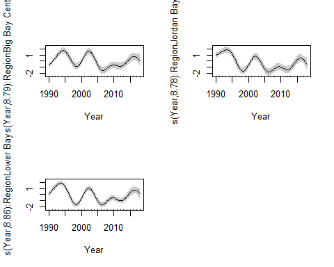
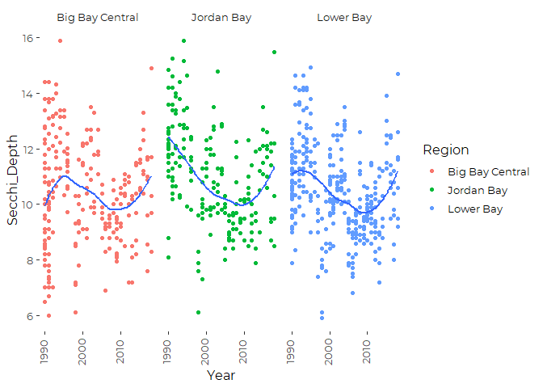

Compare Versions of Sebago Lake Data
================
Curtis C. Bohlen, Casco Bay Estuary Partnership
11/29/2020

  - [Introduction](#introduction)
  - [Load Libraries](#load-libraries)
  - [Load Data](#load-data)
      - [Folder References](#folder-references)
      - [Read Parsed Lakes Data and Limit to Sebago
        Lake](#read-parsed-lakes-data-and-limit-to-sebago-lake)
      - [Read PWD Sebago Lakes Secchi Depth
        Data](#read-pwd-sebago-lakes-secchi-depth-data)
      - [Read Station - Region
        Association](#read-station---region-association)
      - [Add Regions to Data](#add-regions-to-data)
  - [Temporal Patterns](#temporal-patterns)
  - [Analysis Logic](#analysis-logic)
  - [Reduced Data for Simplicity](#reduced-data-for-simplicity)
  - [Spatial Variation?](#spatial-variation)


# Introduction

Sebago lake is our region’s largest lake, and one of the most important.
it is a crucial recreational resource for the region, and also provides
high qUality drinking water for tens of thousands.

Not coincidentally, Sebago Lake also has one of the longest and riches
records of water quality monitoting of any lake in the region.

Here we leverage that rich data to look a bit more closely at how water
clarity varies in space and time.

# Load Libraries

``` r
library(readxl)
#library(readr)
library(tidyverse)
```

    ## -- Attaching packages ---------------------------------------------------------------------------------- tidyverse 1.3.0 --

    ## v ggplot2 3.3.2     v purrr   0.3.4
    ## v tibble  3.0.3     v dplyr   1.0.2
    ## v tidyr   1.1.2     v stringr 1.4.0
    ## v readr   1.3.1     v forcats 0.5.0

    ## -- Conflicts ------------------------------------------------------------------------------------- tidyverse_conflicts() --
    ## x dplyr::filter() masks stats::filter()
    ## x dplyr::lag()    masks stats::lag()

``` r
library(mgcv)
```

    ## Loading required package: nlme

    ## 
    ## Attaching package: 'nlme'

    ## The following object is masked from 'package:dplyr':
    ## 
    ##     collapse

    ## This is mgcv 1.8-33. For overview type 'help("mgcv-package")'.

``` r
library(CBEPgraphics)
load_cbep_fonts()
theme_set(theme_cbep())
```

# Load Data

## Folder References

``` r
sisterfldnm <- 'Derived_Data'
parent <- dirname(getwd())
sister <- file.path(parent,sisterfldnm)
```

## Read Parsed Lakes Data and Limit to Sebago Lake

``` r
fn <- 'Secchi.csv'
Secchi <- read_csv(file.path(sister, fn)) %>%
  filter(MIDAS == 5786) %>%
  mutate(Year = as.numeric(format(Date, format = '%Y')))
```

    ## Parsed with column specification:
    ## cols(
    ##   MIDAS = col_double(),
    ##   Lake = col_character(),
    ##   Town = col_character(),
    ##   Station = col_double(),
    ##   Date = col_datetime(format = ""),
    ##   Time = col_character(),
    ##   Secchi_Depth = col_double(),
    ##   Secchi_On_Bottom = col_character(),
    ##   Scope = col_double(),
    ##   Wind_Level = col_double(),
    ##   Wind_Direction = col_double(),
    ##   Cloud_Cover = col_character()
    ## )

    ## Warning: 9 parsing failures.
    ##  row   col expected actual                                                                                                                              file
    ## 1598 Scope a double      N 'C:/Users/curtis.bohlen/Documents/State of the Bay 2020/Data/A5. Inland Water Quality/Lake_Water_Quality/Derived_Data/Secchi.csv'
    ## 1599 Scope a double      N 'C:/Users/curtis.bohlen/Documents/State of the Bay 2020/Data/A5. Inland Water Quality/Lake_Water_Quality/Derived_Data/Secchi.csv'
    ## 1600 Scope a double      N 'C:/Users/curtis.bohlen/Documents/State of the Bay 2020/Data/A5. Inland Water Quality/Lake_Water_Quality/Derived_Data/Secchi.csv'
    ## 1601 Scope a double      N 'C:/Users/curtis.bohlen/Documents/State of the Bay 2020/Data/A5. Inland Water Quality/Lake_Water_Quality/Derived_Data/Secchi.csv'
    ## 1602 Scope a double      N 'C:/Users/curtis.bohlen/Documents/State of the Bay 2020/Data/A5. Inland Water Quality/Lake_Water_Quality/Derived_Data/Secchi.csv'
    ## .... ..... ........ ...... .................................................................................................................................
    ## See problems(...) for more details.

We remove two values from the Sebago Lake record.

``` r
Secchi <- Secchi %>%
  filter( ! (MIDAS == 5786 & Station == 50))
```

## Read PWD Sebago Lakes Secchi Depth Data

``` r
fn <- 'Secchi_Sebago.csv'
Secchi_Sebago <- read_csv(file.path(sister, fn))
```

    ## Parsed with column specification:
    ## cols(
    ##   MIDAS = col_double(),
    ##   Lake = col_character(),
    ##   Town = col_character(),
    ##   StationName = col_character(),
    ##   Date = col_datetime(format = ""),
    ##   Year = col_double(),
    ##   Secchi_Depth = col_double(),
    ##   Station = col_double()
    ## )

``` r
secchi_sebago_data <- Secchi %>%
  select(-c(Secchi_On_Bottom:Cloud_Cover)) %>%
  bind_rows(Secchi_Sebago)
```

``` r
rm(Secchi, Secchi_Sebago)
```

## Read Station - Region Association

``` r
fn <- 'Sample Point Distances and Regions.xlsx'
regions <- read_excel(file.path(sister, fn), sheet = 'Sample_Locations') %>%
  select(Station, Region)
```

## Add Regions to Data

``` r
secchi_sebago_data <- secchi_sebago_data %>%
  left_join(regions, by = 'Station') %>%
  filter(! is.na(Region)) %>%
  mutate(Region = factor(Region))
```

``` r
rm(regions)
```

# Temporal Patterns

``` r
ggplot(secchi_sebago_data, aes(Year, Secchi_Depth)) +
  geom_point(aes(color = Region)) +
  geom_smooth( se = FALSE) +
  facet_wrap(~Region) +
  theme_cbep(base_size = 12) +
  theme(axis.text.x = element_text(angle = 90, vjust = 0.25))
```

    ## `geom_smooth()` using method = 'loess' and formula 'y ~ x'

    ## Warning: Removed 54 rows containing non-finite values (stat_smooth).

    ## Warning: Removed 54 rows containing missing values (geom_point).

<!-- -->

There are clear patterns there that we do not want to assume are chance,
due to the large number of samples involved, but trends are not
consistent across regions (or, presumably, across Stations).

Note that Big Bay North, Big Bay West, and South Central have limited
samples from the last 10 years or so, While Jordan Bay has little data
from before 1990. We may want to limit data at some point to simplify
analyses.

# Analysis Logic

We are interested in looking at smothed temporal trends, so we are
probably looking at using a GAM model or a GAMM model ifwe want to
explicitly model stations as random factors. hat feels unnecessary for a
preliminary analysis.

``` r
the_gam <- gam(Secchi_Depth ~ Region + s(Year, by = Region), 
               data = secchi_sebago_data)
summary(the_gam)
```

    ## 
    ## Family: gaussian 
    ## Link function: identity 
    ## 
    ## Formula:
    ## Secchi_Depth ~ Region + s(Year, by = Region)
    ## 
    ## Parametric coefficients:
    ##                     Estimate Std. Error t value Pr(>|t|)    
    ## (Intercept)         10.40305    0.11184  93.021   <2e-16 ***
    ## RegionBig Bay North -0.49699    0.38739  -1.283   0.1997    
    ## RegionBig Bay West  -0.22963    0.25587  -0.897   0.3696    
    ## RegionJordan Bay     0.11421    0.44057   0.259   0.7955    
    ## RegionLower Bay     -0.01861    0.13238  -0.141   0.8882    
    ## RegionSouth Central  1.64613    0.85067   1.935   0.0531 .  
    ## ---
    ## Signif. codes:  0 '***' 0.001 '**' 0.01 '*' 0.05 '.' 0.1 ' ' 1
    ## 
    ## Approximate significance of smooth terms:
    ##                                 edf Ref.df      F p-value    
    ## s(Year):RegionBig Bay Central 8.992  9.000 12.745  <2e-16 ***
    ## s(Year):RegionBig Bay North   1.000  1.000  5.069  0.0245 *  
    ## s(Year):RegionBig Bay West    1.000  1.000  5.973  0.0146 *  
    ## s(Year):RegionJordan Bay      6.949  7.185 11.673  <2e-16 ***
    ## s(Year):RegionLower Bay       8.905  8.994 13.363  <2e-16 ***
    ## s(Year):RegionSouth Central   8.847  8.978 17.300  <2e-16 ***
    ## ---
    ## Signif. codes:  0 '***' 0.001 '**' 0.01 '*' 0.05 '.' 0.1 ' ' 1
    ## 
    ## R-sq.(adj) =  0.258   Deviance explained = 27.6%
    ## GCV = 2.3425  Scale est. = 2.2857    n = 1722

``` r
plot(the_gam, shade = TRUE, pages = 1, scale = 0)
```

<!-- -->
Some of those extreme values make no sense in this context, so
something’s not working at the limits.

# Reduced Data for Simplicity

``` r
reduced_data <- secchi_sebago_data %>%
  filter(Year > 1989, ! Region %in% c('Big Bay North',
                                      'Big Bay West',
                                      'South Central'))
```

``` r
reduced_gam <- gam(Secchi_Depth ~ Region + 0 + s(Year, by = Region), 
               data = reduced_data)
summary(reduced_gam)
```

    ## 
    ## Family: gaussian 
    ## Link function: identity 
    ## 
    ## Formula:
    ## Secchi_Depth ~ Region + 0 + s(Year, by = Region)
    ## 
    ## Parametric coefficients:
    ##                       Estimate Std. Error t value Pr(>|t|)    
    ## RegionBig Bay Central 10.39552    0.08800   118.1   <2e-16 ***
    ## RegionJordan Bay      11.03156    0.09702   113.7   <2e-16 ***
    ## RegionLower Bay       10.51846    0.07563   139.1   <2e-16 ***
    ## ---
    ## Signif. codes:  0 '***' 0.001 '**' 0.01 '*' 0.05 '.' 0.1 ' ' 1
    ## 
    ## Approximate significance of smooth terms:
    ##                                 edf Ref.df     F p-value    
    ## s(Year):RegionBig Bay Central 8.792  8.987 10.68  <2e-16 ***
    ## s(Year):RegionJordan Bay      8.783  8.986 15.45  <2e-16 ***
    ## s(Year):RegionLower Bay       8.865  8.994 20.07  <2e-16 ***
    ## ---
    ## Signif. codes:  0 '***' 0.001 '**' 0.01 '*' 0.05 '.' 0.1 ' ' 1
    ## 
    ## R-sq.(adj) =  0.333   Deviance explained = 98.3%
    ## GCV = 2.0734  Scale est. = 2.0013    n = 846

``` r
plot(reduced_gam, se = TRUE, shade = TRUE, pages = 1)
```

<!-- -->
Now THAT looks more informative. Lake wide, there have been periods of
better or worse water clarity, especially around 1990 to 2002 or so.
Since 2006, clarity has gradually improved. It is actually pretty
remarkable that results are so consistent across the lake.

the GGPLOT default smoothers missom of thies detail, because they
oversmooth.

``` r
ggplot(reduced_data, aes(Year, Secchi_Depth)) +
  geom_point(aes(color = Region)) +
  geom_smooth( se = FALSE) +
  facet_wrap(~Region) +
  theme_cbep(base_size = 12) +
  theme(axis.text.x = element_text(angle = 90, vjust = 0.25))
```

    ## `geom_smooth()` using method = 'loess' and formula 'y ~ x'

    ## Warning: Removed 24 rows containing non-finite values (stat_smooth).

    ## Warning: Removed 24 rows containing missing values (geom_point).

<!-- -->

# Spatial Variation?

Without going to the extreme of using geospatial methods, the easiest
way to get a feel for variability associated with location is by looking
at ANOVAs.

``` r
the_lm <- lm(Secchi_Depth ~ factor(Station) + factor(Year), data = secchi_sebago_data)
anova(the_lm)
```

    ## Analysis of Variance Table
    ## 
    ## Response: Secchi_Depth
    ##                   Df  Sum Sq Mean Sq F value    Pr(>F)    
    ## factor(Station)   18  595.34  33.074  20.153 < 2.2e-16 ***
    ## factor(Year)      46 1988.16  43.221  26.335 < 2.2e-16 ***
    ## Residuals       1657 2719.44   1.641                      
    ## ---
    ## Signif. codes:  0 '***' 0.001 '**' 0.01 '*' 0.05 '.' 0.1 ' ' 1

So, the mean square error of the residuals is small compared to station
or Year factors, but the model is unbalanced, so this needs to be
interpreted with care. If we reverse the order of fit, more of the
variance is explained by Year, and less by Station.

``` r
the_lm <- lm(Secchi_Depth ~ factor(Year) + factor(Station),
             data = secchi_sebago_data)
anova(the_lm)
```

    ## Analysis of Variance Table
    ## 
    ## Response: Secchi_Depth
    ##                   Df  Sum Sq Mean Sq F value    Pr(>F)    
    ## factor(Year)      46 2244.37  48.791  29.729 < 2.2e-16 ***
    ## factor(Station)   18  339.12  18.840  11.480 < 2.2e-16 ***
    ## Residuals       1657 2719.44   1.641                      
    ## ---
    ## Signif. codes:  0 '***' 0.001 '**' 0.01 '*' 0.05 '.' 0.1 ' ' 1

``` r
the_lm <- lm(Secchi_Depth ~ factor(Year) + Region + factor(Station),
             data = secchi_sebago_data)
anova(the_lm)
```

    ## Analysis of Variance Table
    ## 
    ## Response: Secchi_Depth
    ##                   Df  Sum Sq Mean Sq F value    Pr(>F)    
    ## factor(Year)      46 2244.37  48.791 29.7290 < 2.2e-16 ***
    ## Region             5  170.79  34.157 20.8125 < 2.2e-16 ***
    ## factor(Station)   13  168.34  12.949  7.8901 1.774e-15 ***
    ## Residuals       1657 2719.44   1.641                      
    ## ---
    ## Signif. codes:  0 '***' 0.001 '**' 0.01 '*' 0.05 '.' 0.1 ' ' 1
