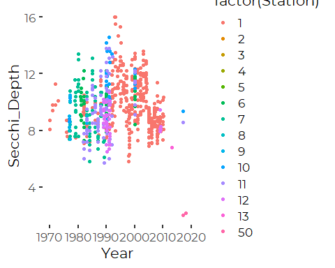
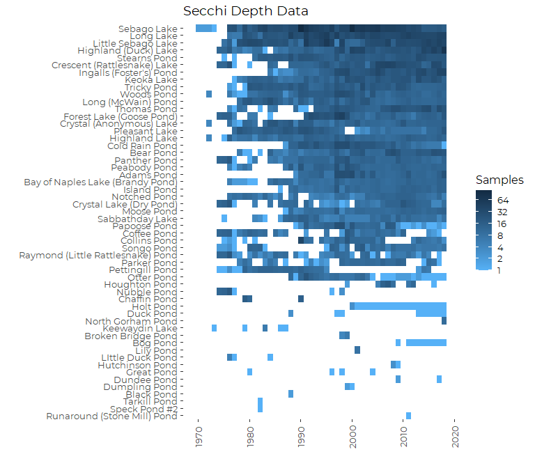
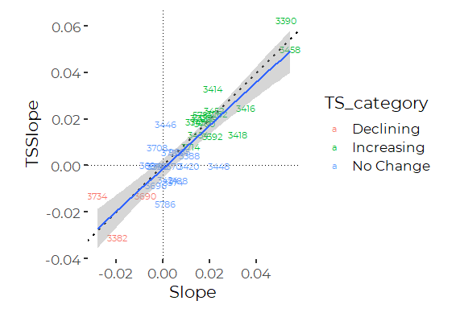
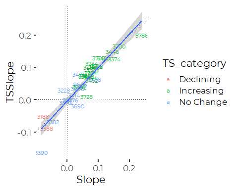
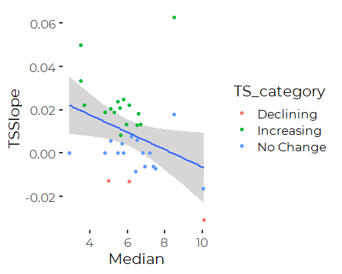

Analysis of Lakes Secchi Depth Trends
================
Curtis C. Bohlen, Casco Bay Estuary Partnership
11/19/2020

-   [Load Libraries](#load-libraries)
-   [Load Data](#load-data)
    -   [Folder References](#folder-references)
    -   [Read Secchi Data](#read-secchi-data)
        -   [Data Cleanup](#data-cleanup)
        -   [Address Inconsistencies in Sebago Lake
            Data](#address-inconsistencies-in-sebago-lake-data)
    -   [Recent Data Subset](#recent-data-subset)
    -   [Read Morphometric Data](#read-morphometric-data)
-   [Lakes With Sufficient Data](#lakes-with-sufficient-data)
    -   [Graphic of Data by Year](#graphic-of-data-by-year)
-   [Analysis](#analysis)
    -   [Basic Lake Info](#basic-lake-info)
    -   [Trends](#trends)
    -   [Select Lakes With Sufficient
        Data](#select-lakes-with-sufficient-data)
        -   [Long Term](#long-term)
        -   [Short Term](#short-term)
    -   [Results](#results)
        -   [Long Term](#long-term-1)
        -   [Test: Comparison of Linear and Thiel-Sen Estimator
            Slopes](#test-comparison-of-linear-and-thiel-sen-estimator-slopes)
        -   [Short-term](#short-term-1)
        -   [Comparison of Linear and Thiel-Sen Estimator
            Slopes](#comparison-of-linear-and-thiel-sen-estimator-slopes)
-   [Final Results Table](#final-results-table)
    -   [Export Results](#export-results)
    -   [View Table](#view-table)
-   [A Side Question](#a-side-question)
-   [Trendlines for All Lakes](#trendlines-for-all-lakes)


# Load Libraries

``` r
library(tidyverse)
```

    ## Warning: package 'tidyverse' was built under R version 4.0.5

    ## -- Attaching packages --------------------------------------- tidyverse 1.3.1 --

    ## v ggplot2 3.3.3     v purrr   0.3.4
    ## v tibble  3.1.2     v dplyr   1.0.6
    ## v tidyr   1.1.3     v stringr 1.4.0
    ## v readr   1.4.0     v forcats 0.5.1

    ## Warning: package 'tidyr' was built under R version 4.0.5

    ## Warning: package 'dplyr' was built under R version 4.0.5

    ## Warning: package 'forcats' was built under R version 4.0.5

    ## -- Conflicts ------------------------------------------ tidyverse_conflicts() --
    ## x dplyr::filter() masks stats::filter()
    ## x dplyr::lag()    masks stats::lag()

``` r
library(readxl)
library(mblm)

library(CBEPgraphics)
load_cbep_fonts()
theme_set(theme_cbep())
```

# Load Data

Here we read in the data, do a lot of renaming, and convert some to
factors, and finally, add a Year term. Note the filter removing NAs is
because one lake is included in these data but has no actual data – only
NAs for the Secchi Depth.

## Folder References

``` r
sibfldnm <- 'Derived_Data'
parent <- dirname(getwd())
sibling <- file.path(parent,sibfldnm)

dir.create(file.path(getwd(), 'figures'), showWarnings = FALSE)
```

## Read Secchi Data

``` r
fn <- 'Secchi.csv'
secchi_data <- read_csv(file.path(sibling, fn))
```

    ## 
    ## -- Column specification --------------------------------------------------------
    ## cols(
    ##   MIDAS = col_double(),
    ##   Lake = col_character(),
    ##   Town = col_character(),
    ##   Station = col_double(),
    ##   Date = col_datetime(format = ""),
    ##   Time = col_character(),
    ##   Secchi_Depth = col_double(),
    ##   Secchi_On_Bottom = col_character(),
    ##   Scope = col_double(),
    ##   Wind_Level = col_double(),
    ##   Wind_Direction = col_double(),
    ##   Cloud_Cover = col_character()
    ## )

    ## Warning: 9 parsing failures.
    ##  row   col expected actual                                                                                                                              file
    ## 1598 Scope a double      N 'C:/Users/curtis.bohlen/Documents/State of the Bay 2020/Data/A5. Inland Water Quality/Lake_Water_Quality/Derived_Data/Secchi.csv'
    ## 1599 Scope a double      N 'C:/Users/curtis.bohlen/Documents/State of the Bay 2020/Data/A5. Inland Water Quality/Lake_Water_Quality/Derived_Data/Secchi.csv'
    ## 1600 Scope a double      N 'C:/Users/curtis.bohlen/Documents/State of the Bay 2020/Data/A5. Inland Water Quality/Lake_Water_Quality/Derived_Data/Secchi.csv'
    ## 1601 Scope a double      N 'C:/Users/curtis.bohlen/Documents/State of the Bay 2020/Data/A5. Inland Water Quality/Lake_Water_Quality/Derived_Data/Secchi.csv'
    ## 1602 Scope a double      N 'C:/Users/curtis.bohlen/Documents/State of the Bay 2020/Data/A5. Inland Water Quality/Lake_Water_Quality/Derived_Data/Secchi.csv'
    ## .... ..... ........ ...... .................................................................................................................................
    ## See problems(...) for more details.

Eight of nine parsing errors are for Scope == “N”, Songo pond, (MIDAS =
3262), for every observation in 2011. We decided that “N” here probably
meant no scope was used, so Scope == 1 (or, Scope = “None”, after
conversion to factor) is appropriate. We wil fix that after we add a
“Year” value to the data.

The ninth parsing error was for an observation from Woods Pond, in June
of 1997, where scope was recorded as “L”. Surrounding values had Scope
== 2 and Scope == 5, so we leave that value as missing.

### Data Cleanup

Here we convert some values to factors, and add Year and month terms.

-   The “Scope” data contains a sixth value Scope == 6, that is not
    referenced in the source Metadata. We declare it as “Undefined”,
    pending clarification from DEP of the lakes monitoring community. If
    we need this information, it may be defined in the Maine Volunteer
    Lakes Monitoring QAPP ore related SOPs. A quick search of online
    documents found the QAPP, but not the SOPs.

-   We filter out NAs is because one lake is included in the data but
    has no actual Secchi data, and it prevents the lake from being
    carried forward.

-   We convert the Lake name to a factor, ordered by median Secchi
    Depth.

-   Coding for the “Secchi\_on\_Bottom” flag is inconsistent, with four
    possible codes: “Y”, “B”, “N”, and "“. We interpret the first two as
    evidence that the Secchi Disk was on the bottom,”N" as evidence that
    it was not, and "" as a missing value.

``` r
secchi_data <- secchi_data %>%
  rename(CensoredFlag = Secchi_On_Bottom) %>%
  mutate(CensoredFlag = fct_recode(CensoredFlag, 'Y'='B')) %>%
  mutate(CensoredFlag = CensoredFlag == 'Y') %>%
           
  mutate(Scope = factor(Scope, levels = as.character(1:6),
                        labels = c('None', 'Plain', 'Slant',
                                   'Slant with Mask', 'Flat with Mask',
                                   'Undefined'))) %>%
  rename(Wind_mph = Wind_Level) %>%
  rename(WindDir = Wind_Direction ) %>%
  mutate(WindDir = factor (WindDir, levels = 1:8,
                           labels = c('N', 'NE', 'E', 'SE',
                                      'S', 'Sw', 'W', 'NW'))) %>%
  rename(CloudCover = Cloud_Cover) %>%
  mutate(CloudCover = factor (CloudCover, levels = c('B', 'C', 'O'),
                              labels = c('Clear', 'Cloudy Bright',
                                         'Heavy Overcast'))) %>%
 
  mutate(Year = as.numeric(format(Date, format = '%Y'))) %>%
  mutate(Month = as.numeric(format(Date, format = '%m'))) %>%
  mutate(Month = factor(Month, levels = 1:12, labels = month.abb)) %>%
  
  mutate(Lake = fct_reorder(factor(Lake), Secchi_Depth)) %>%
  
  filter( ! is.na(Secchi_Depth)) 

  # Correct Parsing Errors
  secchi_data$Scope[secchi_data$MIDAS == 3262 &
                      secchi_data$Year == 2011] <- 'None'
```

### Address Inconsistencies in Sebago Lake Data

``` r
secchi_data %>%
  filter(MIDAS == 5786) %>%
  ggplot(aes(Year, Secchi_Depth, color = factor(Station))) +
  geom_jitter(height = 0, width = 0.1)
```

<!-- -->
This points to several problems:  
1. Sebago Lake has been one of the most consistently sampled lakes,
under a long-running program managed by the Portland Water District. Yet
we have major gaps in the recent record. This probably reflects changes
in how data has been reported to DEP.  
2. The extreme low values in 2017 and 2018 correspond to the only two
samples from a new station. Any recent trend is due to addition of this
anomolous new source of data.

We correct these problems in two steps. First, we load in Portland Water
District’s extensive Sebago Lake archive of Secchi data, then delete two
recent samples that are not reflective of whole-lake conditions.

``` r
fn <- 'Secchi_Sebago.csv'
secchi_sebago_data <- read_csv(file.path(sibling, fn))
```

    ## 
    ## -- Column specification --------------------------------------------------------
    ## cols(
    ##   MIDAS = col_double(),
    ##   Lake = col_character(),
    ##   Town = col_character(),
    ##   StationName = col_character(),
    ##   Date = col_datetime(format = ""),
    ##   Year = col_double(),
    ##   Secchi_Depth = col_double(),
    ##   Station = col_double()
    ## )

``` r
secchi_data <- secchi_data %>%
  bind_rows(secchi_sebago_data)
```

We remove three values from the Sebago Lake record.

``` r
secchi_data <- secchi_data %>%
  filter( ! (MIDAS == 5786 & Station == 50))
```

## Recent Data Subset

We extract a data subset consisting only of data from the last 10 years
of data, 2009-2018.

``` r
recent_data <- secchi_data %>%
  filter (Year>2008)
```

## Read Morphometric Data

Read in morphometric data, and filter to lakes for which we have at
least some Secchi data.

``` r
fn <- 'Lake_Morphometry_Metric.csv'
morpho.data <- read_csv(file.path(sibling, fn))
```

    ## 
    ## -- Column specification --------------------------------------------------------
    ## cols(
    ##   .default = col_double(),
    ##   Lake = col_character(),
    ##   Towns = col_character(),
    ##   Trop_Cat = col_character(),
    ##   Dam = col_character(),
    ##   Major_Drainage = col_character(),
    ##   Sub_Drainage = col_character(),
    ##   HUC10_Name = col_character(),
    ##   USGS_Quad24 = col_character(),
    ##   County = col_character(),
    ##   WQ_Statement = col_character(),
    ##   Invasives = col_character(),
    ##   Fishery = col_character()
    ## )
    ## i Use `spec()` for the full column specifications.

# Lakes With Sufficient Data

## Graphic of Data by Year

``` r
secchi_data %>%
  group_by(MIDAS, Year) %>%
  summarize(Lake = first(Lake),
            Sampled = sum(! is.na(Secchi_Depth)),
            .groups = 'drop_last') %>%
 #mutate(MIDAS2 = fct_reorder(factor(MIDAS), Sampled, sum)) %>%
  ggplot(aes(x = Year, y= fct_reorder(Lake, Sampled, sum), fill = log(Sampled,2))) +
  geom_raster() +
  theme_cbep(base_size = 12) +
  theme(axis.text.x = element_text(angle = 90, vjust = .5)) +
  scale_fill_gradient(breaks = c(0, 1, 2, 3, 4, 5),
                          labels = c(1, 2, 4, 4, 16, 32),
                          name = 'Samples',
                          high = "#132B43",
                          low = "#56B1F7") +
  scale_x_continuous() +
  ylab('') +
  xlab('') +
  ggtitle('Secchi Depth Data')
```

<!-- -->

``` r
# ggsave('figures/current_secchi_data_availability.pdf', device = cairo_pdf,
#         width = 7, height = 8)
```

# Analysis

We could use four distinct strategies for analysis here: (1) Application
of linear models and Thiel-Sen estimators lake by lake (2) Analysis of
medians for each lake, using ordinary least squares (3) Analysis of
medians for each lake, using weighted least squares to account for
changes in sample size (4) Multi-level linear models

But for our purposes, the interest is on properties of individual

## Basic Lake Info

``` r
preresults <- secchi_data %>%
  arrange(MIDAS) %>%
  group_by(MIDAS) %>%
  summarize (
    Samples = n(),
      Stations = length(levels(factor(Station))),
    Years = length(levels(factor(Year))),
    FirstYear = min(Year),
    LastYear = max(Year),
    Mean = mean(Secchi_Depth, na.rm=TRUE),
    Median = median(Secchi_Depth, na.rm=TRUE),
    .groups = 'drop') %>%
  mutate(Lake = morpho.data$Lake[match(MIDAS,morpho.data$MIDAS)])
```

## Trends

The following is based on code originally used in preparing the 2015
State of the Bay Report. The use of a for loop makes this rather
inefficient. A more modern approach would use tidyverse approach using
nested tibbles.

In the following we calculate both Thiel-Sen and linear model slopes.
The Thiel-Sen estimator (actually the modification of that estimator due
to Siegel, according to the help files) is resistant to outliers and
other violations of the assumption of normality. It is thus better
suited to this (unsupervised) application. We calculated linear model
slopes to show that the qualitative results of my analysis are largely
insensitive to the details of the analysis used, but we will report
resukts of the Theil-Sen analysis.

Significance of the Thiel-Sel slopes is based either on the Wilcoxon
Test used in the default `summary.mblm()` function, or on on Kendall’s
Tau. Kendall’s Tau which is conceptually more closely related to the
Thiel-Sen estimator. It effectively tests for a monotonic relationship
(corelation between orderings) between two series.

Some comments: This analysis ignores seasonal patterns and many possible
covariates and confounding variables. It also ignores the fact that we
have right censored data, which is one more reason to prefer Kendall’s
Tau to the linear model.

## Select Lakes With Sufficient Data

We want to select only those lakes with a “reasonable” amount of data
for analyzing trends, both short-term and long-term.

We could soften these constraints using mixed models, but that appears
both statistically unwise and potentially difficult to explain to our
audience.

### Long Term

``` r
TrendLakesMIDAS <- secchi_data %>%
  group_by(MIDAS, Year) %>%
  summarize(Lake = first(Lake),
            Sampled = sum(! is.na(Secchi_Depth)),
            .groups = 'drop_last') %>%
  summarize(Lake = first(Lake),
            nsamples = sum(Sampled),
            nyears = sum(! is.na(Year)),
            nyearsrecent = sum(Sampled[Year>2008] > 0),
            .groups = 'drop_last') %>%

  filter(nyears > 9,
         nyearsrecent > 4 ) %>%
  arrange(MIDAS) %>%
  pull(MIDAS)

lt_results <- secchi_data %>%
  filter(MIDAS %in% TrendLakesMIDAS) %>%
  arrange(MIDAS) %>%
  group_by(MIDAS) %>%
  summarize (
    Samples = n(),
      Stations = length(levels(factor(Station))),
    Years = length(levels(factor(Year))),
    FirstYear = min(Year),
    LastYear = max(Year),
    Mean = mean(Secchi_Depth, na.rm=TRUE),
    Median = median(Secchi_Depth, na.rm=TRUE),
    .groups = 'drop') %>%
  mutate(Lake = morpho.data$Lake[match(MIDAS,morpho.data$MIDAS)])
```

### Short Term

``` r
RecentLakesMIDAS <- secchi_data %>%
  filter(Year > 2008) %>%
  group_by(MIDAS, Year) %>%
  summarize(Lake = first(Lake),
            Sampled = sum(! is.na(Secchi_Depth)),
            .groups = 'drop_last') %>%
  summarize(Lake = first(Lake),
            nsamples = sum(Sampled),
            nyears = sum(! is.na(Year)),
            nyearsrecent = sum(Sampled[Year>2008] > 0),
            .groups = 'drop_last') %>%
  filter(nsamples > 4,
         nyears > 4 ) %>%
  arrange(MIDAS) %>%
  pull(MIDAS)

st_results <- recent_data %>%
  filter(MIDAS %in% RecentLakesMIDAS) %>%
  arrange(MIDAS) %>%
  group_by(MIDAS) %>%
  summarize (
    Samples = n(),
      Stations = length(levels(factor(Station))),
    Years = length(levels(factor(Year))),
    FirstYear = min(Year),
    LastYear = max(Year),
    Mean = mean(Secchi_Depth, na.rm=TRUE),
    Median = median(Secchi_Depth, na.rm=TRUE),
    .groups = 'drop') %>%
  mutate(Lake = morpho.data$Lake[match(MIDAS,morpho.data$MIDAS)])
```

## Results

### Long Term

We calculate lake by lake linear model slopes and Theil-Sen slopes and P
Values. We could also run these models using the nested data frames
approach used for looking at metals in out Toxics data, but this “for
loop” approach works (although inefficiently).

``` r
MIDASES    <- vector(mode = 'numeric', length = 0)
Slopes     <- vector(mode = 'numeric', length = 0)
PValues    <- vector(mode = 'numeric', length = 0)
TSPValues  <- vector(mode = 'numeric', length = 0)
TSSlopes   <- vector(mode = "numeric", length = 0)
TSPValues  <- vector(mode = "numeric", length = 0)
TSKPValues <- vector(mode = "numeric", length = 0)

# This code is inefficient, since it copies vectors repeatedly on copy.
# but this code works no matter how many la
 for (MIDAS in TrendLakesMIDAS) {
   #print(MIDAS)

   thisdata <- secchi_data[secchi_data$MIDAS == MIDAS,]
   
   MIDASES <- append(MIDASES, MIDAS)
   
   LMtest = lm(Secchi_Depth ~ Year, data = thisdata)
   
   Slope = LMtest$coef[2]
   Slopes <- append(Slopes, Slope)
   
   PValue = anova(LMtest)[1,5]
   PValues <- append(PValues, PValue)
   
   tryCatch(TStest <- mblm(Secchi_Depth ~ Year, dataframe = thisdata),
            error = function(err) cat(err, '\n','FAILED:  ', MIDAS, '\n'))
   
   tryCatch( {
       TSSlope    <- TStest$coef[2]
       TSSlopes   <- append(TSSlopes, TSSlope)
       },
       error = function(err) {cat('TSSlopes\n')
                              print(err)})
   
   tryCatch( {
     TSPValue   <- summary(TStest)$coefficients[2,4]
     TSPValues  <- append(TSPValues, TSPValue)
     },
     error = function(err) {cat('TSPvalues\n')
                              print(err)})    
   tryCatch({  
     TSKPValue  <- cor.test(thisdata$Secchi_Depth,thisdata$Year)$p.value
     TSKPValues <- append(TSKPValues, TSKPValue)
     },
     error = function(err) {cat('TSKPValues\n')
                              print(err)})
}
```

    ## Warning in wilcox.test.default(z$slopes): cannot compute exact p-value with
    ## zeroes

    ## Warning in wilcox.test.default(z$slopes): cannot compute exact p-value with
    ## zeroes

As planned, results line up, so we can bind columns together to create a
final dataset.

``` r
any( ! lt_results$MIDAS ==  MIDASES)
```

    ## [1] FALSE

``` r
more <- tibble(Slope = Slopes,
               PValue = PValues, 
               TSSlope = TSSlopes,
               TSPValue = TSPValues,
               TSKPValue = TSKPValues)
lt_results <- lt_results %>%
  bind_cols(more)
rm(more, Slopes, PValues, TSSlopes, TSPValues, TSKPValues)
```

#### Extracting Results

We filter out near-zero slopes (&lt; 0.005m per year, or \~ 5 cm per
decade) as meaningless. We would not normally do that, but the Thiel-Sen
analysis produces couple of lakes with slopes exactly equal to zero,
which nevertheless have statistically significant trends by Kendall’s
tau. This reflects the slightly different meanings of the different
statistical tests involved.

Note that the default test for statistical significance used by `mblm()`
fails regularly with the short data records over the last ten years.

``` r
lt_results <- lt_results %>%
  mutate(lm_sig = PValue<=0.05 & ! abs(Slope) < 0.005,
         lm_category = ifelse(lm_sig ,
                              if_else(Slope < 0, 'Declining', 'Increasing'),
                              'No Change'),
         TS_sig = TSKPValue<=0.05  & ! abs(TSSlope) < 0.005,
         TS_category = ifelse(TS_sig ,
                              if_else(TSSlope < 0, 'Declining', 'Increasing'),
                              'No Change')) %>%
  select(-lm_sig, -TS_sig)
```

``` r
lt_results %>%
  select(MIDAS, Lake, lm_category, TS_category, Samples, FirstYear, LastYear) %>%
  arrange(Lake) %>%
  knitr::kable()
```

| MIDAS | Lake                 | lm\_category | TS\_category | Samples | FirstYear | LastYear |
|------:|:---------------------|:-------------|:-------------|--------:|----------:|---------:|
|  3396 | Adams Pond           | No Change    | No Change    |     432 |      1989 |     2018 |
|  9685 | Bay of Naples Lake   | No Change    | No Change    |     377 |      1976 |     2018 |
|  3420 | Bear Pond            | Increasing   | No Change    |     480 |      1978 |     2018 |
|  3390 | Coffee Pond          | Increasing   | Increasing   |     252 |      1974 |     2017 |
|  3376 | Cold Rain Pond       | No Change    | No Change    |     491 |      1987 |     2018 |
|  3728 | Collins Pond         | No Change    | No Change    |     248 |      1975 |     2018 |
|  3696 | Crescent Lake        | No Change    | No Change    |     720 |      1974 |     2018 |
|  3452 | Crystal Lake         | Increasing   | Increasing   |     510 |      1972 |     2018 |
|  3708 | Crystal Lake         | No Change    | No Change    |     316 |      1974 |     2018 |
|  3712 | Forest Lake          | Increasing   | Increasing   |     536 |      1974 |     2018 |
|  3188 | Foster Pond          | No Change    | No Change    |     671 |      1984 |     2018 |
|  3734 | Highland (Duck) Lake | Declining    | Declining    |     859 |      1974 |     2018 |
|  3454 | Highland Lake        | Increasing   | Increasing   |     497 |      1972 |     2018 |
|  3370 | Holt Pond            | No Change    | No Change    |      21 |      2000 |     2018 |
|  3448 | Island Pond          | Increasing   | No Change    |     341 |      1986 |     2018 |
|  3416 | Keoka Lake           | Increasing   | Increasing   |     663 |      1977 |     2018 |
|  3424 | Little Moose Pond    | No Change    | No Change    |     313 |      1987 |     2018 |
|  3714 | Little Sebago Lake   | Increasing   | Increasing   |    1194 |      1975 |     2018 |
|  5780 | Long Lake            | Increasing   | Increasing   |    1310 |      1976 |     2018 |
|  3418 | Long Pond            | Increasing   | Increasing   |     558 |      1978 |     2018 |
|  3706 | Notched Pond         | Increasing   | Increasing   |     339 |      1976 |     2018 |
|  3458 | Otter Pond           | Increasing   | Increasing   |     174 |      1988 |     2018 |
|  3694 | Panther Pond         | No Change    | No Change    |     461 |      1974 |     2018 |
|  3414 | Papoose Pond         | Increasing   | Increasing   |     267 |      1989 |     2018 |
|  3388 | Parker Pond          | Increasing   | No Change    |     209 |      1978 |     2017 |
|  3374 | Peabody Pond         | No Change    | No Change    |     438 |      1976 |     2018 |
|  3446 | Pleasant Lake        | No Change    | No Change    |     505 |      1977 |     2018 |
|  3690 | Raymond Pond         | Declining    | Declining    |     238 |      1974 |     2017 |
|  3700 | Sabbathday Lake      | Increasing   | Increasing   |     294 |      1975 |     2018 |
|  5786 | Sebago Lake          | No Change    | No Change    |    1723 |      1970 |     2018 |
|  3262 | Songo Pond           | Increasing   | Increasing   |     242 |      1974 |     2018 |
|  3234 | Stearns Pond         | Increasing   | Increasing   |     720 |      1975 |     2018 |
|  3392 | Thomas Pond          | Increasing   | Increasing   |     547 |      1976 |     2018 |
|  3382 | Tricky Pond          | Declining    | Declining    |     650 |      1976 |     2018 |
|  3456 | Woods Pond           | Increasing   | Increasing   |     575 |      1972 |     2018 |

### Test: Comparison of Linear and Thiel-Sen Estimator Slopes

There is a high correlation between the two slope estimators, as one
might expect.

``` r
cor(lt_results$Slope, lt_results$TSSlope)
```

    ## [1] 0.8580664

``` r
plt <-  ggplot(lt_results, aes(Slope, TSSlope))  +
  geom_hline(yintercept = 0, lty = 3) +
  geom_vline(xintercept = 0, lty = 3) +
  geom_abline(intercept = 0, slope = 1, lty = 3) +
  #geom_point(aes(color = Median), size = 5, alpha = 0.5) +
  geom_text(aes(label = MIDAS,  color = TS_category), size = 3) + 

  geom_smooth(method = 'lm')
plt
```

    ## `geom_smooth()` using formula 'y ~ x'

<!-- -->
So results are similar either way. The TS Slope tends to be slightly
lower than the linear model slope, especially for higher values of the
slope, but the regression is not significantly different from a 1:1
line. The two lakes, `MIDAS == 3420` and `MIDAS = 3448` show
statistically significant improving trends by linear model, but not by
Theil-Sen estimators.

### Short-term

``` r
MIDASES    <- vector(mode = 'numeric', length = 0)
Slopes     <- vector(mode = 'numeric', length = 0)
PValues    <- vector(mode = 'numeric', length = 0)
TSPValues  <- vector(mode = 'numeric', length = 0)
TSSlopes   <- vector(mode = "numeric", length = 0)
TSPValues  <- vector(mode = "numeric", length = 0)
TSKPValues <- vector(mode = "numeric", length = 0)


# This code is inefficient, since it copies vectors repeatedly on modify.

 for (MIDAS in RecentLakesMIDAS) {
   #print(MIDAS)

   thisdata <- recent_data[recent_data$MIDAS == MIDAS,]
   
   MIDASES <- append(MIDASES, MIDAS)
   
   LMtest = lm(Secchi_Depth ~ Year, data = thisdata)
   
   Slope = LMtest$coef[2]
   Slopes <- append(Slopes, Slope)
   
   PValue = anova(LMtest)[1,5]
   PValues <- append(PValues, PValue)
  
   tryCatch(TStest <- mblm(Secchi_Depth ~ Year, dataframe = thisdata),
            error = function(err) cat(err, '\n','FAILED:  ', MIDAS, '\n'))
  
   tryCatch( {
       TSSlope    <- TStest$coef[2]
       TSSlopes   <- append(TSSlopes, TSSlope)
       },
       error = function(err) {cat('TSSlopes\n')
                              print(err)})
   
   tryCatch( {
     TSPValue   <- summary(TStest)$coefficients[2,4]
     TSPValues  <- append(TSPValues, TSPValue)
     },
     error = function(err) {cat('TSPvalues\n')
                              print(err)})    
   tryCatch({  
     TSKPValue  <- cor.test(thisdata$Secchi_Depth,thisdata$Year)$p.value
     TSKPValues <- append(TSKPValues, TSKPValue)
     },
     error = function(err) {cat('TSKPValues\n')
                              print(err)})
}
```

    ## Warning in wilcox.test.default(z$intercepts): cannot compute exact p-value with
    ## ties

    ## Warning in wilcox.test.default(z$slopes): cannot compute exact p-value with ties

    ## Warning in wilcox.test.default(z$slopes): cannot compute exact p-value with
    ## zeroes

    ## Warning in wilcox.test.default(z$intercepts): cannot compute exact p-value with
    ## ties

    ## Warning in wilcox.test.default(z$slopes): cannot compute exact p-value with ties

    ## Warning in wilcox.test.default(z$slopes): cannot compute exact p-value with
    ## zeroes

    ## Warning in wilcox.test.default(z$intercepts): cannot compute exact p-value with
    ## ties

    ## Warning in wilcox.test.default(z$slopes): cannot compute exact p-value with ties

    ## Warning in wilcox.test.default(z$intercepts): cannot compute exact p-value with
    ## ties

    ## Warning in wilcox.test.default(z$slopes): cannot compute exact p-value with ties

    ## Warning in wilcox.test.default(z$intercepts): cannot compute exact p-value with
    ## ties

    ## Warning in wilcox.test.default(z$slopes): cannot compute exact p-value with ties

    ## Warning in wilcox.test.default(z$slopes): cannot compute exact p-value with
    ## zeroes

    ## Warning in wilcox.test.default(z$intercepts): cannot compute exact p-value with
    ## ties

    ## Warning in wilcox.test.default(z$slopes): cannot compute exact p-value with ties

    ## Warning in wilcox.test.default(z$slopes): cannot compute exact p-value with
    ## zeroes

    ## Warning in wilcox.test.default(z$intercepts): cannot compute exact p-value with
    ## ties

    ## Warning in wilcox.test.default(z$slopes): cannot compute exact p-value with ties

    ## Warning in wilcox.test.default(z$intercepts): cannot compute exact p-value with
    ## ties

    ## Warning in wilcox.test.default(z$slopes): cannot compute exact p-value with ties

    ## Warning in wilcox.test.default(z$intercepts): cannot compute exact p-value with
    ## ties

    ## Warning in wilcox.test.default(z$slopes): cannot compute exact p-value with ties

    ## Warning in wilcox.test.default(z$intercepts): cannot compute exact p-value with
    ## ties

    ## Warning in wilcox.test.default(z$slopes): cannot compute exact p-value with ties

    ## Warning in wilcox.test.default(z$intercepts): cannot compute exact p-value with
    ## ties

    ## Warning in wilcox.test.default(z$slopes): cannot compute exact p-value with
    ## zeroes

    ## Warning in wilcox.test.default(z$intercepts): cannot compute exact p-value with
    ## ties

    ## Warning in wilcox.test.default(z$slopes): cannot compute exact p-value with
    ## zeroes

    ## Warning in wilcox.test.default(z$intercepts): cannot compute exact p-value with
    ## ties

    ## Warning in wilcox.test.default(z$slopes): cannot compute exact p-value with ties

    ## Warning in wilcox.test.default(z$intercepts): cannot compute exact p-value with
    ## ties

    ## Warning in wilcox.test.default(z$slopes): cannot compute exact p-value with ties

    ## Warning in wilcox.test.default(z$intercepts): cannot compute exact p-value with
    ## ties

    ## Warning in wilcox.test.default(z$slopes): cannot compute exact p-value with ties

    ## Warning in wilcox.test.default(z$slopes): cannot compute exact p-value with
    ## zeroes

    ## Warning in wilcox.test.default(z$intercepts): cannot compute exact p-value with
    ## ties

    ## Warning in wilcox.test.default(z$slopes): cannot compute exact p-value with ties

    ## Warning in wilcox.test.default(z$slopes): cannot compute exact p-value with
    ## zeroes

    ## Warning in wilcox.test.default(z$intercepts): cannot compute exact p-value with
    ## ties

    ## Warning in wilcox.test.default(z$slopes): cannot compute exact p-value with ties

    ## Warning in wilcox.test.default(z$slopes): cannot compute exact p-value with
    ## zeroes

    ## Warning in wilcox.test.default(z$intercepts): cannot compute exact p-value with
    ## ties

    ## Warning in wilcox.test.default(z$slopes): cannot compute exact p-value with ties

    ## Warning in wilcox.test.default(z$slopes): cannot compute exact p-value with
    ## zeroes

As planned, results should line up, so we can bind columns together to
create a final dataset.

``` r
any( ! st_results$MIDAS ==  MIDASES)
```

    ## [1] FALSE

``` r
more <- tibble(Slope = Slopes,
               PValue = PValues, 
               TSSlope = TSSlopes,
               TSPValue = TSPValues,
               TSKPValue = TSKPValues)
st_results <- st_results %>%
  bind_cols(more)
rm(more, Slopes, PValues, TSSlopes, TSPValues, TSKPValues)
```

#### Results

We filter out near-zero slopes (&lt; 0.005 m per year, or \~ 5 cm per
decade) as meaningless. We would not normally do that, but the Thiel-Sen
slopes produces couple of lakes with slopes exactly equal to zero, which
nevertheless has statistically significant trends by Kendall’s tau.

``` r
st_results <- st_results %>%
  mutate(lm_sig = PValue<=0.05 & ! abs(Slope) < 0.005,
         lm_category = ifelse(lm_sig ,
                              if_else(Slope < 0, 'Declining', 'Increasing'),
                              'No Change')) %>%
  mutate(TS_sig = TSKPValue<=0.05  & ! abs(TSSlope) < 0.005,
         TS_category = ifelse(TS_sig ,
                              if_else(TSSlope < 0, 'Declining', 'Increasing'),
                              'No Change')) %>%
  select(-lm_sig, -TS_sig)
```

### Comparison of Linear and Thiel-Sen Estimator Slopes

There is only moderate correlation between the two slope estimators.

``` r
cor(st_results$Slope, st_results$TSSlope)
```

    ## [1] 0.9349034

``` r
plt <-  ggplot(st_results, aes(Slope, TSSlope))  +
   geom_hline(yintercept = 0, lty = 3) +
   geom_vline(xintercept = 0, lty = 3) +
   geom_abline(intercept = 0, slope = 1, lty = 3) +
   #geom_point(aes(color = Median), size = 5, alpha = 0.5) +
   geom_text(aes(label = MIDAS,  color = TS_category), size = 3) +

  geom_smooth(method = 'lm')
plt
```

    ## `geom_smooth()` using formula 'y ~ x'

<!-- -->

``` r
st_results %>%
  select(MIDAS, Lake, lm_category, TS_category, Samples, FirstYear, LastYear) %>%
  arrange(Lake) %>%
  knitr::kable()
```

| MIDAS | Lake                 | lm\_category | TS\_category | Samples | FirstYear | LastYear |
|------:|:---------------------|:-------------|:-------------|--------:|----------:|---------:|
|  3396 | Adams Pond           | Increasing   | Increasing   |     138 |      2009 |     2018 |
|  9685 | Bay of Naples Lake   | No Change    | No Change    |     120 |      2009 |     2018 |
|  3420 | Bear Pond            | Increasing   | Increasing   |     185 |      2009 |     2018 |
|  3417 | Bog Pond             | No Change    | No Change    |       9 |      2009 |     2018 |
|  3390 | Coffee Pond          | No Change    | No Change    |      22 |      2009 |     2017 |
|  3376 | Cold Rain Pond       | No Change    | No Change    |      76 |      2009 |     2018 |
|  3728 | Collins Pond         | Increasing   | Increasing   |      48 |      2012 |     2018 |
|  3696 | Crescent Lake        | No Change    | No Change    |     236 |      2009 |     2018 |
|  3452 | Crystal Lake         | Increasing   | Increasing   |     135 |      2009 |     2018 |
|  3708 | Crystal Lake         | Increasing   | Increasing   |     116 |      2009 |     2018 |
|  3228 | Duck Pond            | No Change    | No Change    |       6 |      2013 |     2018 |
|  3712 | Forest Lake          | No Change    | No Change    |     122 |      2009 |     2018 |
|  3188 | Foster Pond          | Declining    | Declining    |     269 |      2009 |     2018 |
|  3734 | Highland (Duck) Lake | Increasing   | Increasing   |     333 |      2009 |     2018 |
|  3454 | Highland Lake        | Increasing   | Increasing   |     131 |      2009 |     2018 |
|  3370 | Holt Pond            | No Change    | No Change    |      10 |      2009 |     2018 |
|  3448 | Island Pond          | Increasing   | Increasing   |     128 |      2009 |     2018 |
|  3416 | Keoka Lake           | Increasing   | Increasing   |     212 |      2009 |     2018 |
|  3424 | Little Moose Pond    | No Change    | No Change    |     121 |      2009 |     2018 |
|  3714 | Little Sebago Lake   | Increasing   | Increasing   |     342 |      2009 |     2018 |
|  5780 | Long Lake            | Increasing   | Increasing   |     374 |      2009 |     2018 |
|  3418 | Long Pond            | Increasing   | Increasing   |     122 |      2009 |     2018 |
|  3706 | Notched Pond         | Increasing   | Increasing   |     106 |      2009 |     2018 |
|  3458 | Otter Pond           | No Change    | No Change    |      14 |      2009 |     2018 |
|  3694 | Panther Pond         | Increasing   | Increasing   |     120 |      2009 |     2018 |
|  3414 | Papoose Pond         | No Change    | No Change    |      16 |      2009 |     2018 |
|  3388 | Parker Pond          | Declining    | Declining    |      45 |      2009 |     2017 |
|  3374 | Peabody Pond         | Increasing   | Increasing   |     120 |      2009 |     2018 |
|  3446 | Pleasant Lake        | Increasing   | Increasing   |     100 |      2009 |     2018 |
|  3690 | Raymond Pond         | No Change    | No Change    |      41 |      2009 |     2017 |
|  3700 | Sabbathday Lake      | Increasing   | Increasing   |      91 |      2009 |     2018 |
|  5786 | Sebago Lake          | Increasing   | Increasing   |     276 |      2009 |     2018 |
|  3262 | Songo Pond           | Increasing   | Increasing   |      74 |      2009 |     2018 |
|  3234 | Stearns Pond         | Increasing   | Increasing   |     225 |      2009 |     2018 |
|  3392 | Thomas Pond          | Increasing   | Increasing   |     231 |      2009 |     2018 |
|  3382 | Tricky Pond          | No Change    | No Change    |     148 |      2009 |     2018 |
|  3456 | Woods Pond           | Increasing   | Increasing   |     126 |      2009 |     2018 |

So, results are similar, although Theil-Sen detects two fewer lakes with
significant increases in water clarity.

# Final Results Table

``` r
lt_results_minimal <- lt_results %>%
  select(MIDAS, Lake, FirstYear, LastYear, Samples, Stations, Years, Median, TSSlope, TS_category)

st_results_minimal <- st_results %>%
  select(MIDAS, Lake, FirstYear, LastYear, Samples, Stations, Years, Median, TSSlope, TS_category)

combined_results <- lt_results_minimal %>%
  full_join(st_results_minimal,
            by = c("MIDAS", "Lake"),
            suffix = c('_lt', '_st'))
```

## Export Results

``` r
write_csv(combined_results, 'table_of_trends.csv')
```

## View Table

``` r
combined_results %>%
  mutate(TS_category_lt = factor(TS_category_lt, levels = c('Declining', 
                                                            'No Change',
                                                            'Increasing')),
         TS_category_st = factor(TS_category_st, levels = c('Declining', 
                                                            'No Change',
                                                            'Increasing'))) %>%
  select(Lake, Samples_lt, FirstYear_lt, TS_category_st, TS_category_lt) %>%
  arrange(Lake) %>%
  
  knitr::kable(align = "lccll", col.names = c('Lake', 'Observations', 
                                              'Earliest Data', 'Recent Trend',
                                              'Long Term Trend'))
```

| Lake                 | Observations | Earliest Data | Recent Trend | Long Term Trend |
|:---------------------|:------------:|:-------------:|:-------------|:----------------|
| Adams Pond           |     432      |     1989      | Increasing   | No Change       |
| Bay of Naples Lake   |     377      |     1976      | No Change    | No Change       |
| Bear Pond            |     480      |     1978      | Increasing   | No Change       |
| Bog Pond             |      NA      |      NA       | No Change    | NA              |
| Coffee Pond          |     252      |     1974      | No Change    | Increasing      |
| Cold Rain Pond       |     491      |     1987      | No Change    | No Change       |
| Collins Pond         |     248      |     1975      | Increasing   | No Change       |
| Crescent Lake        |     720      |     1974      | No Change    | No Change       |
| Crystal Lake         |     510      |     1972      | Increasing   | Increasing      |
| Crystal Lake         |     316      |     1974      | Increasing   | No Change       |
| Duck Pond            |      NA      |      NA       | No Change    | NA              |
| Forest Lake          |     536      |     1974      | No Change    | Increasing      |
| Foster Pond          |     671      |     1984      | Declining    | No Change       |
| Highland (Duck) Lake |     859      |     1974      | Increasing   | Declining       |
| Highland Lake        |     497      |     1972      | Increasing   | Increasing      |
| Holt Pond            |      21      |     2000      | No Change    | No Change       |
| Island Pond          |     341      |     1986      | Increasing   | No Change       |
| Keoka Lake           |     663      |     1977      | Increasing   | Increasing      |
| Little Moose Pond    |     313      |     1987      | No Change    | No Change       |
| Little Sebago Lake   |     1194     |     1975      | Increasing   | Increasing      |
| Long Lake            |     1310     |     1976      | Increasing   | Increasing      |
| Long Pond            |     558      |     1978      | Increasing   | Increasing      |
| Notched Pond         |     339      |     1976      | Increasing   | Increasing      |
| Otter Pond           |     174      |     1988      | No Change    | Increasing      |
| Panther Pond         |     461      |     1974      | Increasing   | No Change       |
| Papoose Pond         |     267      |     1989      | No Change    | Increasing      |
| Parker Pond          |     209      |     1978      | Declining    | No Change       |
| Peabody Pond         |     438      |     1976      | Increasing   | No Change       |
| Pleasant Lake        |     505      |     1977      | Increasing   | No Change       |
| Raymond Pond         |     238      |     1974      | No Change    | Declining       |
| Sabbathday Lake      |     294      |     1975      | Increasing   | Increasing      |
| Sebago Lake          |     1723     |     1970      | Increasing   | No Change       |
| Songo Pond           |     242      |     1974      | Increasing   | Increasing      |
| Stearns Pond         |     720      |     1975      | Increasing   | Increasing      |
| Thomas Pond          |     547      |     1976      | Increasing   | Increasing      |
| Tricky Pond          |     650      |     1976      | No Change    | Declining       |
| Woods Pond           |     575      |     1972      | Increasing   | Increasing      |

Relevant sample sizes and starting dates for Duck and Bog ponds are as
follows:

``` r
secchi_data %>%
  filter(MIDAS %in% c(3228, 3417)) %>%
  group_by(MIDAS) %>%
  summarize(Lake = first(Lake),
            FirstYear = min(Year, na.rm = TRUE),
            Samples = sum(! is.na(Secchi_Depth)))
```

    ## # A tibble: 2 x 4
    ##   MIDAS Lake      FirstYear Samples
    ##   <dbl> <chr>         <dbl>   <int>
    ## 1  3228 Duck Pond      1988      11
    ## 2  3417 Bog Pond       2009       9

# A Side Question

Are trends related to overall clarity?

``` r
m <- lm( TSSlope ~ Median, data = lt_results)
summary(m)
```

    ## 
    ## Call:
    ## lm(formula = TSSlope ~ Median, data = lt_results)
    ## 
    ## Residuals:
    ##       Min        1Q    Median        3Q       Max 
    ## -0.026428 -0.010649 -0.001484  0.008383  0.062982 
    ## 
    ## Coefficients:
    ##              Estimate Std. Error t value Pr(>|t|)   
    ## (Intercept)  0.033802   0.011635   2.905   0.0065 **
    ## Median      -0.004010   0.001847  -2.171   0.0372 * 
    ## ---
    ## Signif. codes:  0 '***' 0.001 '**' 0.01 '*' 0.05 '.' 0.1 ' ' 1
    ## 
    ## Residual standard error: 0.01738 on 33 degrees of freedom
    ## Multiple R-squared:  0.125,  Adjusted R-squared:  0.09846 
    ## F-statistic: 4.713 on 1 and 33 DF,  p-value: 0.03722

So, the slopes tend to be SLIGHTLY lower for lakes with higher Median
Secchi depth….

``` r
ggplot(lt_results, aes(Median, TSSlope)) +
  geom_smooth(method = 'lm') +
  geom_point(aes(color = TS_category))
```

    ## `geom_smooth()` using formula 'y ~ x'

<!-- -->

So if there is a relationship, it’s weak and predominately due to two
lakes, so we won’t take it too seriously.

# Trendlines for All Lakes

``` r
secchi_data %>%
filter(MIDAS %in% RecentLakesMIDAS) %>%
  ggplot(aes(Year, Secchi_Depth)) +
  geom_line(aes(group = MIDAS),
            stat="smooth",
            method = "lm", se = FALSE,
            color = cbep_colors()[1],
            lwd = 0.5,
            alpha = 0.5) +
  ylab('Secchi Depth (m)') +
  ggtitle("Trends in Lake Clarity") +
  theme_cbep(base_size = 12) +
  theme(panel.grid.major.y = element_line('gray')) +
  scale_x_continuous(limits = c(1970, 2022))
```

    ## `geom_smooth()` using formula 'y ~ x'

<!-- -->

``` r
ggsave('figures/secchi_trends.pdf', device = cairo_pdf,
       width = 5, height = 6)
```

    ## `geom_smooth()` using formula 'y ~ x'
